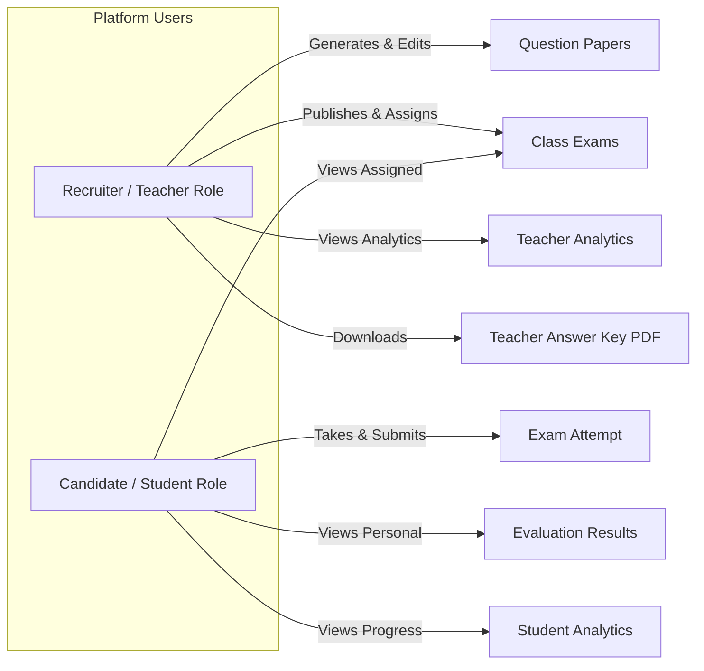
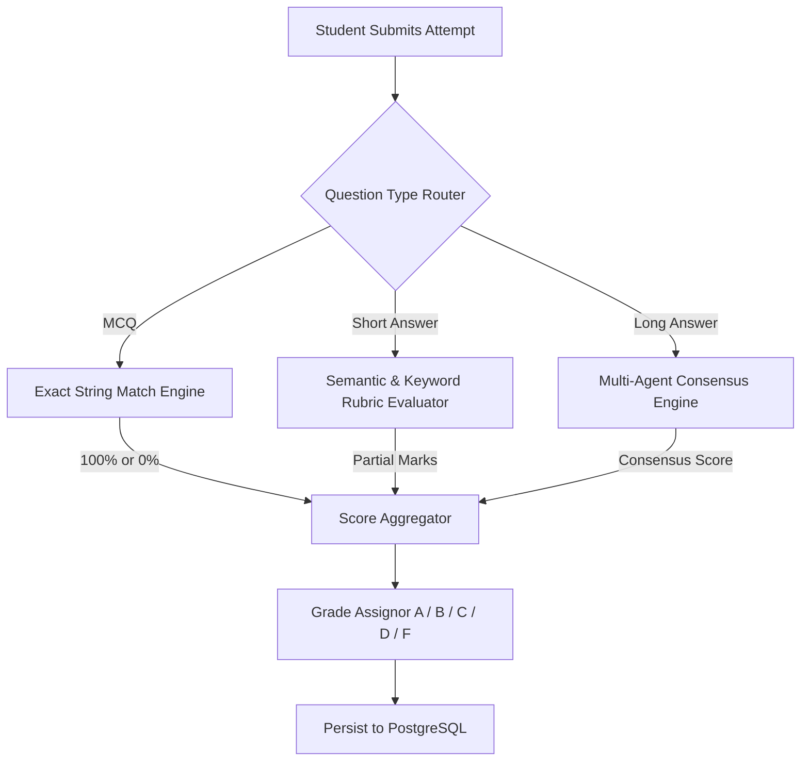
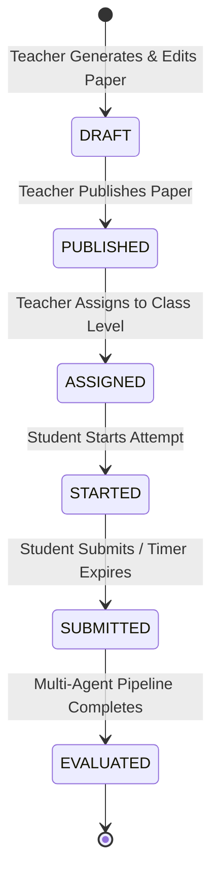
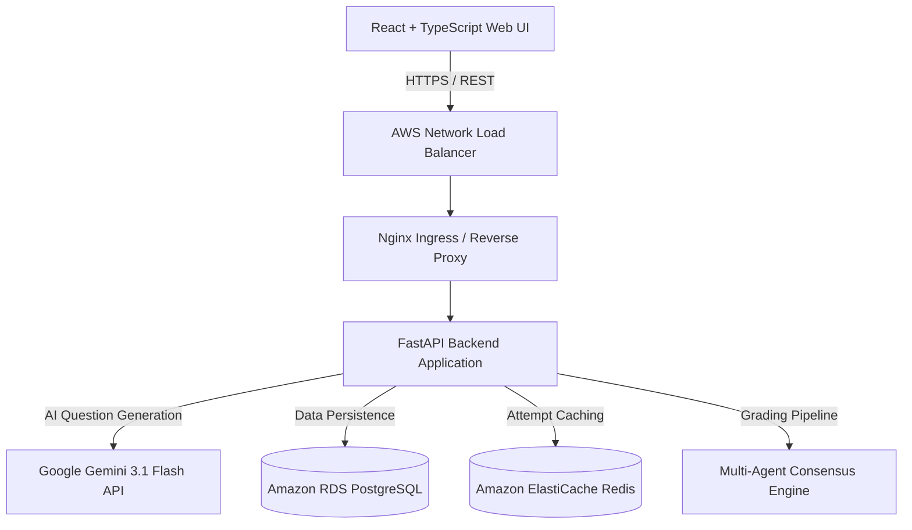

# Multi-Agent Exam & Evaluation Portal

### AI-Powered Smart Learning & Assessment Platform for K-12 Education


---

## 1. Project Overview

The **Multi-Agent Exam & Evaluation Portal** (EduExam) is an enterprise-grade, cloud-native digital assessment and AI evaluation platform designed specifically for K-12 educational institutions (Classes 1–12).

The platform transforms traditional examination workflows by integrating **Google Gemini** for multi-lingual (`English` & `Kannada`) structured question paper generation across three source material modes (`TOPIC_ONLY`, `PDF_ONLY`, `PDF_AND_TOPIC`) and combining it with a resilient, server-side **Multi-Agent Evaluation Engine** for automated student answer grading.

Deployed on **Amazon EKS (Elastic Kubernetes Service)** in `us-east-1`, the system enforces class-level authorization, Insecure Direct Object Reference (IDOR) protection, candidate answer-key sanitization, server-authoritative countdown timers, auto-saving answer buffers, and interactive performance analytics for students and educators.

---

## 2. Problem Statement

Educational institutions face critical bottlenecks in manual assessment workflows:
- **Time-Consuming Exam Creation**: Creating high-quality, topic-targeted, multi-lingual questions tailored for specific grade levels requires hours of manual drafting.
- **Inconsistent & Subjective Evaluation**: Manual grading of short and long descriptive answers leads to evaluation variance, slow feedback turnarounds, and human error.
- **Security & Authorization Vulnerabilities**: Paper leaks, unauthorized cross-class exam access, client-side timer manipulation, and exposed solution keys compromise examination integrity.
- **Lack of Actionable Analytics**: Teachers lack itemized question difficulty metrics and student topic-level mastery insights to drive targeted remediation.

---

## 3. Solution

EduExam delivers an end-to-end, highly secure, AI-powered assessment ecosystem:
1. **AI Question Synthesis**: Teachers generate structured, syllabus-aligned question papers (MCQ, Short Answer, Long Answer) in seconds using Google Gemini with strict topic targeting (`exact_topic`).
2. **Review & Draft Controls**: Teachers maintain full editorial authority—reviewing, editing, adding/deleting questions, and saving draft papers before publishing.
3. **Secure Class-Level Assignment**: Published exams are targeted explicitly to specific grade levels (e.g., Class 7), preventing unauthorized access by students in other grades.
4. **Server-Authoritative Exam Workspace**: Students take exams within a secure, auto-saving interface featuring server-managed countdown timers and crash-resistant session resume.
5. **Multi-Agent Automated Grading**: Submitted exams are graded automatically using exact matching for MCQs, rubric-based partial credit for short answers, and multi-agent consensus for long descriptive responses.
6. **Real-Time Performance Analytics**: Dashboards deliver real-time student grade trends, subject proficiency breakdowns, question itemized accuracy, and sortable class performance rosters.

---

## 4. Key Features

### Educator / Teacher Workspace
- **Grade & Subject Targeting**: Select Class Level (1–12), Subject, Language (`English`, `Kannada`), Difficulty (`Easy`, `Medium`, `Hard`), and Question Count (2 to 50+).
- **Multi-Mode Question Generation**: Generate questions from topic alone (`TOPIC_ONLY`), uploaded PDF study materials (`PDF_ONLY`), or PDF context combined with topic isolation (`PDF_AND_TOPIC`).
- **Interactive Question Editor**: Review generated questions, edit question prompts, adjust options, modify correct answers, edit explanations, and reorder sections before saving draft papers.
- **Publishing & Assignment Engine**: Publish question papers and assign active test windows to targeted student classes.
- **Official Answer Key Generator**: Generate teacher-only step-by-step marking scheme PDFs.
- **Class & Question Analytics**: View exam performance metrics, score distributions, itemized question difficulty (`Easy`/`Medium`/`Hard`), and student rosters with performance flags (`High Performer`, `Average`, `Needs Improvement`).

### Student / Candidate Workspace
- **Class-Filtered Exam Catalog**: Access assigned exams matching the student's enrolled grade level.
- **Server-Authoritative Exam Timer**: Take exams with a server-managed countdown timer ($\text{expires\_at} - \text{now}$) unaffected by client clock changes or browser refreshes.
- **Auto-Saving Answer Engine**: Answers auto-save continuously in the background to prevent data loss.
- **Seamless Refresh / Resume**: Re-opening an active attempt restores saved answers instantly.
- **Evaluated Results Dashboard**: View score breakdowns ($25.0/30.0$), Percentage ($83.33\%$), Letter Grade ($A$), and itemized question feedback.
- **Performance Timeline**: Track score progression trends over time and subject proficiency.

---

## 5. User Roles



---

## 6. AI Question Generation

Question generation leverages **Google Gemini 3.1 Flash Lite** via the official `google-genai` SDK (`from google import genai`).

- **Structured Output**: Enforces strict JSON schemas returning structured sections, question prompts, options, correct answers, explanations, and mark weightings.
- **Language Support**: Generates authentic educational content in **English** and **Kannada**.
- **No Fallback Contamination**: When `AI_PROVIDER=gemini` is configured, errors raise explicit exceptions without silent fallbacks to static question templates.

```json
{
  "generation_provider": "GEMINI",
  "topic": "Photosynthesis",
  "sections": [
    {
      "name": "Section A (MCQ)",
      "question_type": "MCQ",
      "questions": [
        {
          "number": 1,
          "question": "Which solar spectrum component is most absorbed by chlorophyll a?",
          "options": ["Green light", "Red and Blue light", "Yellow light", "Infrared light"],
          "correct_answer": "Red and Blue light",
          "marks": 5.0
        }
      ]
    }
  ]
}
```

---

## 7. Multi-Agent Evaluation Engine

Student answer evaluation is decoupled from question generation and handled by the backend **Multi-Agent Evaluation Pipeline**:



- **MCQ Evaluation**: Exact-string match against ground truth (100% or 0% marks).
- **Short-Answer Evaluation**: Partial credit evaluation comparing student response against rubric concepts ($0 \le \text{awarded\_marks} \le \text{max\_marks}$).
- **Long-Answer Evaluation**: Multi-agent consensus engine scoring factual accuracy, clarity, and structural completeness.

---

## 8. Exam Lifecycle



---

## 9. Security Architecture

1. **JWT Authentication**: HMAC SHA-256 tokens carrying `sub`, `role` (`recruiter` / `candidate`), and `class_level` (1–12).
2. **Class-Level Authorization**: Enforces strict grade matching; Class 8 students attempting Class 7 exams receive `403 Forbidden`.
3. **IDOR Protection**: Validates resource ownership on every request; students cannot view other students' attempts or results (`403 Forbidden`).
4. **Answer-Key Sanitization**: Candidate API responses strictly strip out `correct_answer`, `solution`, `explanation`, `teacher_rubric`, and agent prompts.
5. **Server-Authoritative Timer**: Remaining time is computed server-side ($\text{expires\_at} - \text{now}$); client clock manipulation has zero effect.
6. **Submission Immutability**: Submitting locks the attempt; subsequent answer updates return `400 Bad Request`.

---

## 10. Analytics Engine

- **Student Summary & Performance**: Calculates completed exams, average percentage, latest grade, score trend line over time, and subject proficiency bars.
- **Teacher Exam Analytics**: Computes total assigned students, completed submissions, average score, high/low scores, pass rate (%), score standard deviation, and grade distribution histogram.
- **Itemized Question Analytics**: Tracks correct count, incorrect count, skipped count, average score, and accuracy percentage per question with dynamic difficulty classification (`Easy` $\ge 75\%$, `Medium` $45-74\%$, `Hard` $< 45\%$).
- **Student Performance Roster**: Renders a sortable roster with submission status, score, percentage, grade, and automated performance flags (`High Performer`, `Average`, `Needs Improvement`).

---

## 11. Technology Stack

- **Backend**: Python 3.11+, FastAPI, Uvicorn, Pydantic, SQLAlchemy ORM, PyPDF.
- **Frontend**: React 18, TypeScript, Vite, Tailwind CSS, Lucide Icons, Axios.
- **AI Integration**: Google Gemini 3.1 Flash Lite (`google-genai` SDK).
- **Database & Cache**: Amazon RDS PostgreSQL 15, Amazon ElastiCache Redis.
- **Containers & Orchestration**: Docker, Amazon ECR, Amazon EKS (Kubernetes).
- **Networking**: AWS Network Load Balancer (NLB), Nginx Ingress Controller.

---

## 12. System Architecture



---

## 13. AWS Deployment Architecture

Deployed in AWS `us-east-1` within Kubernetes namespace `multi-agent-exam`:
- **Cluster**: `multi-agent-exam-production-cluster`
- **Frontend Pod**: `exam-portal-frontend-664bd987c5-zsw22` (`1/1 Running`)
- **Backend Pod**: `exam-portal-backend-5c5d49f55d-jxzkf` (`1/1 Running`)
- **Live Demo Entrypoint**: `http://ae7437d5531624dbd8d018588b30e79f-1203586077.us-east-1.elb.amazonaws.com`
- **Protocol Note**: Demo currently uses HTTP via AWS Load Balancer; HTTPS termination with custom domain is a recommended production enhancement.

---

## 14. Source Material Modes

1. **`TOPIC_ONLY`**: Generates new questions based purely on specified grade, subject, and topic.
2. **`PDF_ONLY`**: Analyzes uploaded study material PDF and synthesizes questions covering the PDF context.
3. **`PDF_AND_TOPIC`**: Uses uploaded PDF for underlying context while focusing question synthesis on `exact_topic`. (Questions are newly generated, not copied verbatim).

---

## 15. Question Generation Flow

1. Teacher enters parameters (Class, Subject, Language, Topic, Difficulty, Sections).
2. FastAPI sends structured request to Google Gemini API using `google-genai` SDK.
3. Gemini returns structured JSON question schema.
4. Teacher reviews, edits, and saves paper draft.

---

## 16. Student Exam Flow

1. Student views assigned exams filtered by `class_level`.
2. Student starts attempt $\rightarrow$ Server initializes `started_at` and `expires_at`.
3. Student inputs answers $\rightarrow$ Background `PUT` request auto-saves responses.
4. Student submits exam $\rightarrow$ Attempt status set to `SUBMITTED`.

---

## 17. Evaluation Flow

1. Submitted attempt enters `EvaluationService`.
2. Question-type router grades MCQs (exact match), Short Answers (rubric partial credit), and Long Answers (multi-agent consensus).
3. Evaluated result persisted to `evaluation_results` in PostgreSQL.

---

## 18. API Overview

Detailed endpoint specifications are documented in [`docs/api.md`](docs/api.md):
- `POST /api/v1/auth/login` — Authentication & JWT issuance
- `POST /api/v1/question-papers/generate` — Gemini AI question paper generation
- `POST /api/v1/question-papers` — Save paper draft
- `POST /api/v1/question-papers/{id}/publish` — Publish paper
- `POST /api/v1/exams/{id}/assign` — Assign exam to class level
- `GET /api/v1/exams` — Candidate exam catalog (class-filtered)
- `POST /api/v1/exams/{id}/attempts` — Start exam attempt
- `PUT /api/v1/attempts/{id}/answers` — Auto-save candidate answers
- `POST /api/v1/attempts/{id}/submit` — Submit attempt & trigger evaluation
- `GET /api/v1/attempts/{id}/result` — View evaluation result
- `GET /api/v1/analytics/teacher/summary` — Teacher overview analytics
- `GET /api/v1/analytics/exams/{id}/performance` — Exam performance metrics

---

## 19. Database Architecture

Detailed ER diagrams and model schemas are documented in [`docs/database.md`](docs/database.md):
- `users` (Roles: `recruiter`, `candidate`, `class_level`)
- `question_papers` $\rightarrow$ `sections` $\rightarrow$ `questions`
- `exams` $\rightarrow$ `exam_assignments`
- `candidate_attempts` $\rightarrow `candidate_answers`
- `evaluation_results` (1-to-1 with attempt)

---

## 20. Local Development Setup

### Prerequisites
- Python 3.11+
- Node.js 18+ & npm
- PostgreSQL & Redis (or Docker Compose)

### Backend Setup
```bash
cd backend
python -m venv venv
source venv/bin/activate  # Or venv\Scripts\activate on Windows
pip install -r requirements.txt
cp .env.example .env
# Fill in GEMINI_API_KEY, DATABASE_URL, REDIS_URL, JWT_SECRET
uvicorn app.main:app --reload --port 8000
```

### Frontend Setup
```bash
cd frontend
npm install
npm run dev
```

---

## 21. Production Deployment

Production container build and Kubernetes deployment steps are documented in [`docs/deployment.md`](docs/deployment.md).

---

## 22. Testing & Verification

Automated test suites in `scratch/` provide 100% verified coverage across all phases:
- `scratch/test_phase47_final_qa.py` — Complete 22-area production QA suite.

See [`docs/testing.md`](docs/testing.md) for full execution logs.

---

## 23. Security & Compliance

Security controls, RBAC policies, and production hardening recommendations are documented in [`docs/security.md`](docs/security.md).

---

## 24. Screenshots & Visual Assets

> **Note**: Screenshot placeholders are indexed in [`docs/screenshots/README.md`](docs/screenshots/README.md) (`PENDING MANUAL CAPTURE`).

### Teacher — AI Question Generation & Review


### Student — Exam Workspace & Server Timer


### Results & Teacher Analytics


---

## 25. Project Structure

```
multi-agent-exam-portal/
├── backend/
│   ├── app/
│   │   ├── agents/            # Multi-Agent evaluation provider architecture
│   │   ├── ai/                # Gemini AI integration engine
│   │   ├── analytics/         # Teacher & Student analytics service
│   │   ├── api/               # FastAPI routers (auth, exams, attempts, analytics)
│   │   ├── core/              # Config, security & JWT utilities
│   │   ├── database/          # SQLAlchemy models & DB session
│   │   ├── schemas/           # Pydantic validation schemas
│   │   └── services/          # Business logic services
│   ├── Dockerfile.backend
│   └── requirements.txt
├── frontend/
│   ├── src/
│   │   ├── api/               # Axios API client functions
│   │   ├── components/        # UI components & widgets
│   │   ├── pages/             # Teacher & Student workspace pages
│   │   └── types/             # TypeScript interface definitions
│   ├── Dockerfile.frontend
│   └── package.json
├── docs/                      # Architectural & API documentation
│   ├── api.md
│   ├── architecture.md
│   ├── database.md
│   ├── demo-checklist.md
│   ├── demo-data.md
│   ├── deployment.md
│   ├── interview-preparation.md
│   ├── resume-bullets.md
│   ├── security.md
│   └── testing.md
├── k8s/                       # Kubernetes EKS manifests
├── scratch/                   # Automated integration test scripts
├── docker-compose.yml
├── .env.example
└── README.md
```

---

## 26. Future Enhancements & Roadmap

### Currently Implemented
- [x] Gemini structured question generation (`TOPIC_ONLY`, `PDF_ONLY`, `PDF_AND_TOPIC`).
- [x] English & Kannada language educational question synthesis.
- [x] Teacher draft editor, review workflow, and publishing engine.
- [x] Class-level assignment isolation (Classes 1–12).
- [x] Student exam workspace with server-authoritative timer & background autosave.
- [x] Multi-agent automated evaluation (MCQ exact, Short answer partial credit, Long answer consensus).
- [x] Teacher & Student performance analytics dashboards.
- [x] AWS EKS Kubernetes production deployment.

### Future Enhancements Roadmap
- [ ] HTTPS termination at AWS ALB using ACM TLS certificates.
- [ ] AWS WAF integration for web application firewall protection.
- [ ] Automated CI/CD build and deployment pipeline via GitHub Actions.
- [ ] Centralized secrets management via AWS Secrets Manager.
- [ ] Celery asynchronous worker queue for large PDF background parsing.

---

## 27. Author & Contact

**Bheemalingappa**
- Portfolio Project: Multi-Agent Exam & Evaluation Portal (EduExam)
- Repository: `Bheemalingappa/bheemalingappa-ai-data-science-portfolio`
