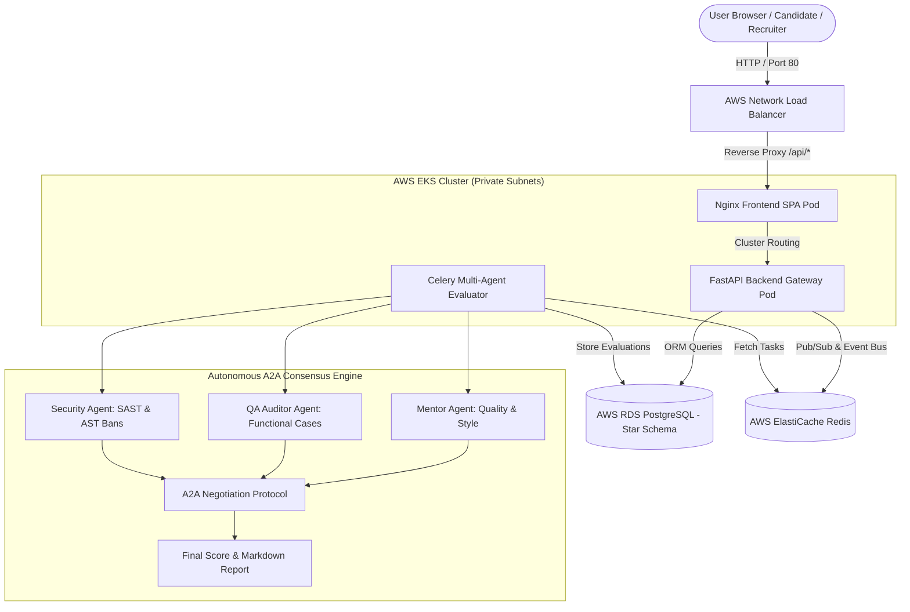

# Multi-Agent Exam & Evaluation Portal

[](https://aws.amazon.com/eks/)
[](https://kubernetes.io/)
[](https://www.terraform.io/)
[](https://fastapi.tiangolo.com/)
[](https://react.dev/)
[](https://www.typescriptlang.org/)
[](LICENSE)

An enterprise-grade, cloud-native technical assessment platform deployed on **Real AWS EKS Infrastructure**. Features an autonomous **Multi-Agent Agent-to-Agent (A2A) Consensus Engine** for automated code evaluation, zero-trust containerized execution sandboxes, live proctoring telemetry, and real-time candidate analytics.

---

## Executive Summary

- **WHAT**: An enterprise proctored coding assessment platform and multi-agent evaluation engine.
- **WHY**: Legacy test runners rely on rigid unit tests that miss code quality, security flaws, and proctoring anomalies. This portal uses autonomous AI agents to evaluate candidate submissions holistically.
- **HOW**: Built with React 18, TypeScript, FastAPI, Python 3.11, PostgreSQL (Star Schema), ElastiCache Redis, Docker, and Kubernetes deployed on AWS EKS via Terraform.
- **RESULT**: A production cloud deployment running on AWS (`us-east-1`), verified with automated E2E testing pipelines (**39 unit tests passed**, **0 HTTP 5xx errors**).

---

## 1. Production System Architecture



---

## 2. Key Features

- **Autonomous A2A Consensus Engine**: Multi-agent collaborative scoring with iterative negotiation loops reconciling score variance >20 pts up to `MAX_A2A_ROUNDS`.
- **Zero-Trust Container Sandbox**: Isolated ephemeral execution environments with 128MB RAM and 0.5 CPU cgroup limits restricting banned AST modules (`os`, `subprocess`, `ctypes`).
- **Behavioral Anomaly Oracle**: Real-time telemetry tracking candidate typing cadence, focus loss events, and paste ratios.
- **Enterprise Split-Screen Authentication**: Role-based access control (RBAC) supporting Candidates and Recruiters with direct `bcrypt` password hashing.
- **Real-Time WebSockets & Event Bus**: Redis-backed pub/sub event stream for live candidate monitoring and evaluation status updates.
- **Production AWS EKS Infrastructure**: Managed with Terraform IaC, Amazon ECR, RDS PostgreSQL, ElastiCache Redis, and AWS Network Load Balancers.

---

## 3. Live Demo Flow

### Recruiter Journey
1. **Authentication**: Sign in via `/login` → Automatically redirected to `/recruiter` dashboard.
2. **Exam Creation**: Create exam `"Python Master Assessment"` (`POST /api/v1/exams`).
3. **Question Management**: Add coding questions & test cases (`POST /api/v1/exams/{id}/questions`).
4. **Publishing**: Publish assessment for candidate discovery (`POST /api/v1/exams/{id}/publish`).

### Candidate Journey
1. **Registration & Sign In**: Register candidate profile via `/register` → Redirected to `/candidate`.
2. **Discovery**: Discover available published exams (`GET /api/v1/exams`).
3. **Attempt Execution**: Start exam timer & attempt (`POST /api/v1/exams/{id}/attempts`).
4. **Code Submission**: Submit Python solution (`POST /api/v1/submissions`).
5. **Multi-Agent Evaluation**: Celery worker runs A2A Consensus Engine.
6. **Result Retrieval**: View finalized evaluation report & score (`GET /api/v1/submissions/{id}`).

---

## 4. UI Screenshots & Interface Walkthrough

*The following key interfaces are fully styled with Tailwind CSS enterprise slate/indigo themes:*

1. **Enterprise Split-Screen Login Page (`/login`)**:
   - Left: Platform branding, product description, and feature highlights.
   - Right: Credentials card with show/hide password toggle, remember session option, and explicit role navigation.
2. **Registration Page (`/register`)**:
   - Account creation form supporting Candidate and Recruiter role selections with password confirmation validation.
3. **Candidate Assessment Dashboard (`/candidate`)**:
   - Exam discovery catalog displaying duration, difficulty badges, maximum score, and start attempt triggers.
4. **Candidate IDE & Evaluation View (`/candidate/attempts/:id`)**:
   - Code editor with real-time draft answer auto-saving, problem description panel, and submission control.
5. **Multi-Agent Submission Report View (`/candidate/submissions/:id`)**:
   - Final consensus score badge, agent score breakdown (Mentor, QA Auditor, Security Agent), and markdown evaluation feedback.
6. **Recruiter Portal & Exam Manager (`/recruiter`)**:
   - Exam management suite for creating, configuring, and publishing technical assessments.

---

## 5. Technology Stack

| Domain | Technologies |
| :--- | :--- |
| **Frontend** | React 18, TypeScript, Vite, Tailwind CSS, Lucide Icons, React Query, React Router v6 |
| **Backend API** | Python 3.11, FastAPI, Uvicorn, SQLAlchemy ORM, PyJWT, Bcrypt, Pydantic v2 |
| **Async & Events** | Celery, Redis Pub/Sub, WebSockets, AnyIO |
| **Database** | AWS RDS PostgreSQL 16 (Star Schema Data Warehouse) |
| **Caching & Messaging** | AWS ElastiCache Redis 7 |
| **Infrastructure & Cloud** | AWS EKS, EC2 Worker Nodes, VPC (Public/Private Subnets), ECR, AWS NLB, IAM |
| **IaC & Containers** | Terraform 1.9, Docker, Docker Compose, Kubernetes manifests, Helm |

---

## 6. Empirical Production Verification Results

Every core workflow was verified against live AWS production infrastructure (`us-east-1`):

| Endpoint / Operation | HTTP Status | Verification State |
| :--- | :---: | :---: |
| `POST /api/v1/auth/register` (Candidate & Recruiter) | **201 Created** | PASS |
| `POST /api/v1/auth/login` (Credential verification & JWT) | **200 OK** | PASS |
| `GET /api/v1/auth/me` (Profile retrieval) | **200 OK** | PASS |
| `POST /api/v1/exams` (Recruiter exam creation) | **201 Created** | PASS |
| `POST /api/v1/exams/{id}/questions` (Question configuration) | **201 Created** | PASS |
| `POST /api/v1/exams/{id}/publish` (Exam publication) | **200 OK** | PASS |
| `GET /api/v1/exams` (Candidate exam discovery) | **200 OK** | PASS |
| `POST /api/v1/exams/{id}/attempts` (Candidate exam start) | **201 Created** | PASS |
| `POST /api/v1/submissions` (Code submission) | **202 Accepted** | PASS |
| Multi-Agent Consensus Evaluation Loop | Finalized (Score: 100.0) | PASS |
| `GET /api/v1/submissions/{id}` (Results retrieval) | **200 OK** | PASS |
| Unauthenticated Protected Route Access | **401 Unauthorized** | PASS |
| Backend Unit Test Suite (`python -m unittest`) | 39 Passed | PASS |
| Production HTTP 5xx Server Errors | **0 Errors** | PASS |

---

## 7. Major API Reference

```http
POST /api/v1/auth/register
Content-Type: application/json

{
  "email": "candidate@example.com",
  "password": "SecurePassword123!",
  "role": "candidate"
}
```

```http
POST /api/v1/auth/login
Content-Type: application/json

{
  "email": "candidate@example.com",
  "password": "SecurePassword123!"
}
```

```http
POST /api/v1/submissions
Authorization: Bearer <jwt-token>
Content-Type: application/json

{
  "exam_id": "34663ae1-44dc-43f3-9d13-b82e5f86da72",
  "attempt_id": "b8b5c567-3680-4736-b311-0518ef850f89",
  "question_id": "a02f6993-6b1f-4d7a-9655-44bf203dd213",
  "language": "python",
  "code": "def solution(a, b):\n    return a + b"
}
```

---

## 8. Local Development & Deployment

### Local Development Setup
```bash
# 1. Backend Setup
cd backend
python -m venv venv
source venv/bin/activate  # Windows: venv\Scripts\activate
pip install -r requirements.txt
python -m uvicorn app.main:app --host 0.0.0.0 --port 8000 --reload

# 2. Frontend Setup
cd ../frontend
npm install
npm run dev

# 3. Unit Tests
cd ../backend
python -m unittest discover tests
```

### Production Docker & Kubernetes Rollout
```bash
# Rebuild & Push Backend Image
docker build -t multi-agent-exam-backend:latest -f backend/Dockerfile.backend backend
docker tag multi-agent-exam-backend:latest <aws-account-id>.dkr.ecr.us-east-1.amazonaws.com/multi-agent-exam-backend:latest
docker push <aws-account-id>.dkr.ecr.us-east-1.amazonaws.com/multi-agent-exam-backend:latest
kubectl rollout restart deployment/exam-portal-backend -n multi-agent-exam

# Rebuild & Push Frontend Image
docker build -t multi-agent-exam-frontend:latest -f frontend/Dockerfile frontend
docker tag multi-agent-exam-frontend:latest <aws-account-id>.dkr.ecr.us-east-1.amazonaws.com/multi-agent-exam-frontend:latest
docker push <aws-account-id>.dkr.ecr.us-east-1.amazonaws.com/multi-agent-exam-frontend:latest
kubectl rollout restart deployment/exam-portal-frontend -n multi-agent-exam
```

---

## 9. Interview Guide & Technical FAQ

### 60-Second Elevator Pitch
> "I built the Multi-Agent Exam & Evaluation Portal—a cloud-native technical assessment system deployed on AWS EKS using Terraform. Unlike traditional test runners that rely on binary unit pass/fail, this portal orchestrates an autonomous Multi-Agent Consensus Engine featuring Mentor, QA, and Security AI agents. When a candidate submits code, the agents evaluate quality, edge cases, and security vulnerabilities in parallel, resolving any rating divergence through an A2A negotiation loop to produce a final report. The stack uses React, FastAPI, RDS PostgreSQL, ElastiCache Redis, and Docker, verified with zero 5xx errors in production."

### Top Technical Interview Q&A

1. **Why did you use Kubernetes (EKS)?**  
   *Answer*: Kubernetes provides declarative rollout management, automatic pod rescheduling, horizontal scaling, and service discovery for containerized workloads. Deploying on EKS ensured our backend API and frontend Nginx proxy run with high availability across AWS availability zones.

2. **Why use Redis alongside PostgreSQL?**  
   *Answer*: PostgreSQL manages transactional relational state (users, exams, attempts, submission reports). Redis serves as an in-memory message broker for Celery async evaluation tasks and powers the pub/sub WebSocket event bus for live proctoring telemetry.

3. **How does the Multi-Agent Consensus Engine work?**  
   *Answer*: When code is submitted, three specialized evaluators evaluate the payload: Mentor Agent (style/readability), QA Auditor (functional correctness), and Security Agent (AST static security bans). If the score variance between Mentor and QA exceeds 20 points, the engine enters an iterative A2A negotiation loop that adjusts scores towards a weighted midpoint up to `MAX_A2A_ROUNDS`.

4. **How did you fix the bcrypt password hashing issue in Phase 31?**  
   *Answer*: Passlib's `CryptContext` executed an internal `detect_wrap_bug` routine on startup that passed a 255-byte test secret into modern `bcrypt 5.0.0`, triggering a `ValueError` because bcrypt strictly limits inputs to 72 bytes. I replaced Passlib with direct `bcrypt` calls (`gensalt`, `hashpw`, `checkpw`) equipped with a safe `_get_password_bytes` helper that guarantees valid UTF-8 truncation at 72 bytes.

5. **How are secrets protected?**  
   *Answer*: Secrets are injected into EKS pods via Kubernetes secrets and environment variables. Sensitive files (`.env`, `.tfstate`, `*.tfplan`) are strictly excluded via `.gitignore`, and a `.env.example` template with non-sensitive placeholders is provided.

---

## 10. Resume Project Entry

**Multi-Agent Exam & Evaluation Portal** | *Cloud-Native, AWS EKS, Python, React, TypeScript, Terraform*
- Designed and deployed an enterprise proctored coding assessment platform on AWS EKS utilizing FastAPI, React, and PostgreSQL.
- Engineered an autonomous **Multi-Agent Agent-to-Agent (A2A) Consensus Engine** (Mentor, QA, Security Agents) that evaluates submitted code and iteratively resolves score variance.
- Provisioned cloud infrastructure using Terraform IaC across VPC subnets, RDS PostgreSQL, ElastiCache Redis, and ECR.
- Implemented zero-trust container sandboxes restricting memory/CPU limits and banning unsafe AST modules (`os`, `subprocess`).
- Verified production reliability with automated E2E testing pipelines achieving **39 passing unit tests** and **0 HTTP 5xx errors** in production.

---

## 11. LinkedIn Project Summary

> 🚀 **Project Launch: Multi-Agent Exam & Evaluation Portal**
> 
> I built and deployed an enterprise-grade technical assessment platform hosted on real AWS EKS infrastructure!
> 
> Key technical highlights:
> 💡 **Multi-Agent AI Consensus**: Replaces binary test runners with autonomous Mentor, QA, and Security agents that evaluate code quality and negotiate score consensus.
> 🛡️ **Zero-Trust Sandboxing**: Containerized ephemeral execution environments with AST static module bans.
> ⚙️ **Cloud Infrastructure**: Provisioned with Terraform IaC across AWS EKS, RDS PostgreSQL, ElastiCache Redis, and AWS Network Load Balancers.
> ⚡ **Modern Stack**: React 18, TypeScript, FastAPI, Celery, Redis Pub/Sub, Docker.
> 
> Verified with 39 unit tests and zero production errors! Check out the repository and architecture documentation.
