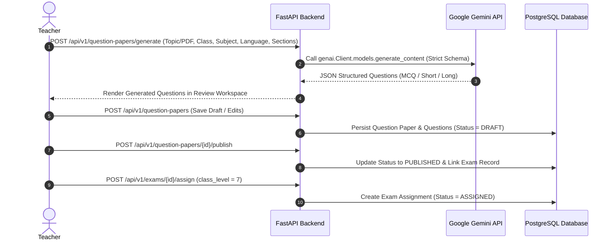
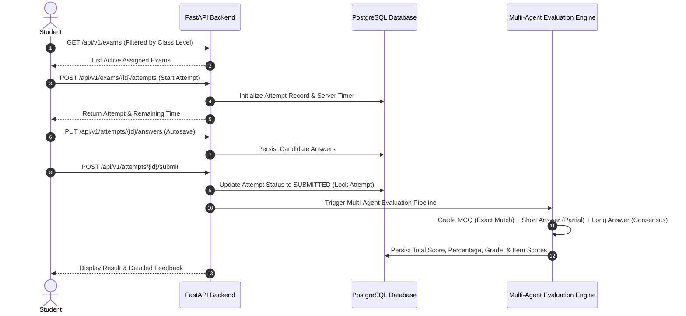

# System Architecture & Flow Documentation

## 1. High-Level Architecture Overview

The **Multi-Agent Exam & Evaluation Portal** (EduExam) is designed as a cloud-native, microservice-ready assessment platform for K-12 educational institutions (Classes 1–12). The system decouples AI Question Generation (powered by Google Gemini) from Student Answer Evaluation (powered by the backend Multi-Agent consensus and rubric engine).

```mermaid
graph TD
    subgraph Client Layer
        Teacher["Teacher Portal (React + TS)"]
        Student["Student Portal (React + TS)"]
    end

    subgraph Ingress & Networking Layer
        NLB["AWS Network Load Balancer (NLB)"]
        Nginx["Nginx Reverse Proxy / Ingress Controller"]
    end

    subgraph Application Service Layer (AWS EKS)
        FastAPI["FastAPI Backend Application"]
        AuthMiddleware["JWT & Class Authorization Middleware"]
        GenEngine["Gemini Question Generation Engine"]
        EvalEngine["Multi-Agent Answer Evaluation Engine"]
    end

    subgraph Data & Cache Layer (AWS Cloud)
        RDS[("Amazon RDS PostgreSQL (Application Data & Evaluation Records)")]
        Redis[("Amazon ElastiCache Redis (Session & Attempt Caching)")]
    end

    subgraph External AI Services
        GeminiAPI["Google Gemini 3.1 Flash Lite API (google-genai SDK)"]
    end

    Teacher --> NLB
    Student --> NLB
    NLB --> Nginx
    Nginx --> FastAPI

    FastAPI --> AuthMiddleware
    AuthMiddleware --> GenEngine
    AuthMiddleware --> EvalEngine

    GenEngine --> GeminiAPI
    EvalEngine --> RDS
    EvalEngine --> Redis

    FastAPI --> RDS
    FastAPI --> Redis
```

---

## 2. Component Breakdown

### A. Client Layer (Frontend)
- **Framework**: React 18 with TypeScript, Vite, Tailwind CSS, Lucide Icons.
- **Role Portals**:
  - **Teacher Workspace**: Question generation interface (Topic, PDF, PDF+Topic), question paper draft editor, publishing modal, class assignment control, answer key viewer, exam & question performance analytics.
  - **Student Workspace**: Class-filtered exam catalog, exam workspace with server-authoritative timer, auto-saving answer engine, submission confirmation, evaluated results dashboard.

### B. Gateway & API Layer (Backend)
- **Framework**: FastAPI (Python 3.11+ / Uvicorn).
- **Authentication**: JWT bearer tokens with embedded role (`recruiter` / `candidate`) and `class_level` claims.
- **Middleware**: Custom CORS configuration, exception handling middleware, and role-based access control (RBAC).

### C. Data & Caching Layer
- **PostgreSQL (RDS)**: Persistent relational store for users, question papers, questions, sections, exam assignments, candidate exam attempts, question answers, multi-agent evaluation outputs, and student proficiency metrics.
- **Redis (ElastiCache)**: Ephemeral caching for candidate attempt state, active timers, and rate limiting.

### D. AI & Evaluation Layer
- **Google Gemini 3.1 Flash Lite**: Interfaced via the official `google-genai` SDK (`from google import genai`). Handles structured question synthesis for `TOPIC_ONLY`, `PDF_ONLY`, and `PDF_AND_TOPIC` modes in English and Kannada.
- **Multi-Agent Evaluation Pipeline**: Routes student answers based on question type:
  - **MCQ**: Exact-match deterministic grading.
  - **Short Answer**: Rubric-guided keyword & semantic evaluation with partial credit.
  - **Long Answer**: Multi-agent consensus scoring (evaluating correctness, clarity, completeness, and structural accuracy).

---

## 3. Data Flow Pathways

### A. Question Paper Generation & Publishing Flow


### B. Student Exam & Multi-Agent Evaluation Flow

